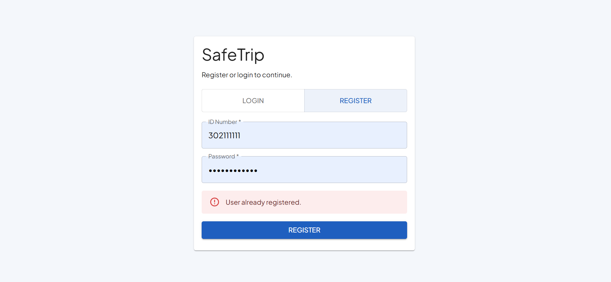
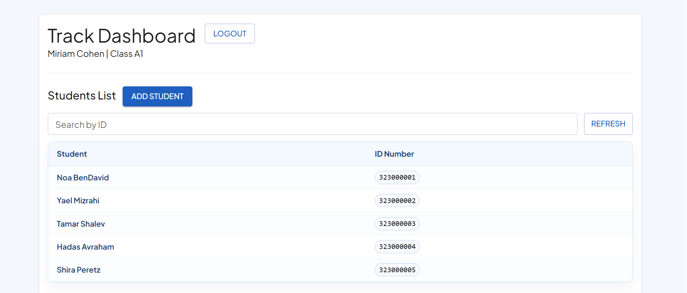
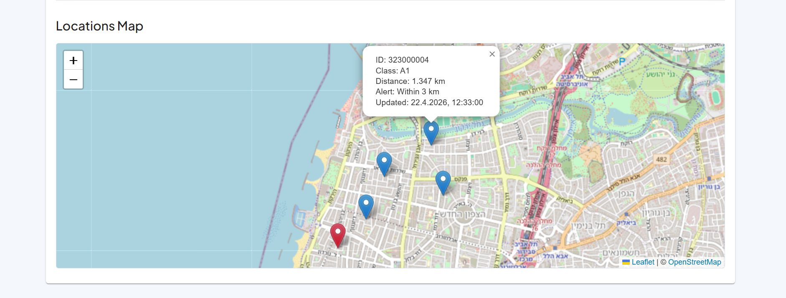
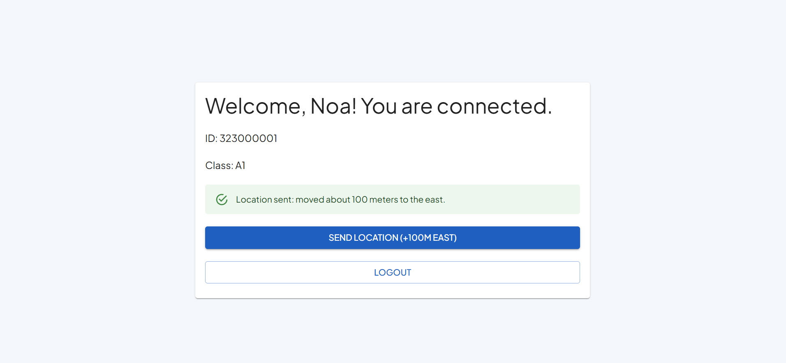

# SafeTrip - School Trip Management and Tracking

SafeTrip is a school-trip management system for Banot Moshe 6th-grade classes.
It combines three things in one project:
- registration and class management,
- live map tracking for students,
- automatic too-far alerts for teachers.

## Server Overview

Server folder: server

What the server handles:
- Secure authentication with JWT cookie.
- Role-based access control (teacher and student).
- Teacher and student data insertion and retrieval.
- Student location ingest from tracking payloads.
- Teacher class location view with distance and too-far flags.

Main API groups:
- Authentication: register, login, logout.
- Teachers: insert and retrieve teacher records (teacher-only routes).
- Students: insert and retrieve student records (teacher-only routes).
- Tracking:
- Receive location updates from student devices.
- Return latest student locations.
- Let teacher fetch class students locations with:
- each student location,
- each student air-distance from teacher,
- too-far flag (true when distance > 3 km).
- Provide authenticated student latest location endpoint (used for development/testing flow).

Detailed API request/response documentation:
- server/README.md

## Client Overview

Client folder: client

### Teacher dashboard
Teacher can:
- View class students in a table.
- Search students by ID.
- Add new students.
- See all class students on a map.
- Instantly identify too-far students by marker color.
- Manually refresh data.

Auto-refresh behavior:
- The dashboard asks the server for updated location data every 5 seconds.

Too-far visual rule:
- Red marker: student is farther than 3 km from teacher.
- Default marker: student is within 3 km.

### Student page
Student can:
- Login and view profile details.
- Logout.
- Click Send Location (+100m East).

What the button does:
- Reads student latest location from server.
- Computes a point about 100 meters east.
- Sends new location payload in the same DMS tracking format.

## Database Overview

Main tables:
- Teachers
- Students
- Passwords
- StudentLocationsLatest
- TeacherLocationsLatest

## How to Run

1. Initialize database and seed data:
- In server folder: npm run init-db

2. Start server:
- In server folder: npm run start

3. Start client:
- In client folder: npm run dev

## Notes

- Full server endpoint docs are in server/README.md.
- Current teacher dashboard polling interval is 5 seconds.

## Screenshots

### 1. Authentication
Register and login flow for teacher/student users.

### 2. Teacher Dashboard
Main teacher workspace: students table, map tracking, and too-far visualization.

### 3. Student Page
Student view with profile details and the quick location update action.

